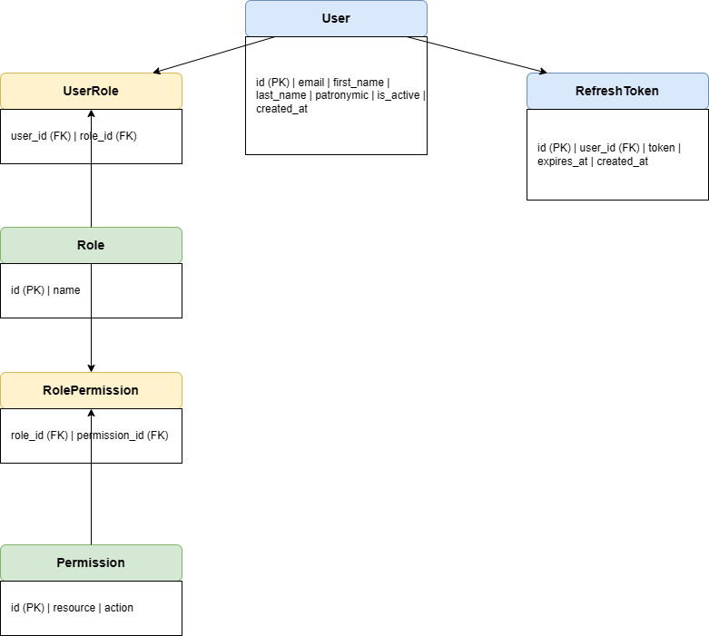

# Auth System: система аутентификации и авторизации

Backend-приложение с собственной системой аутентификации и авторизации на основе JWT токенов и ролевой модели управления доступом (RBAC).

---

## Стек технологий

- **Python 3.12**
- **Django 5.x** — основной фреймворк
- **Django REST Framework** — построение REST API
- **PostgreSQL** — база данных
- **PyJWT** — работа с JWT токенами
- **python-dotenv** — управление переменными окружения

---

## Описание RBAC схемы

В проекте реализована система управления доступом на основе ролей (Role-Based Access Control).

### Принцип работы

1. Каждый пользователь имеет одну или несколько **ролей**
2. Каждая роль имеет набор **разрешений**
3. Каждое разрешение — это комбинация **ресурса** и **действия**
4. При запросе к защищённому эндпоинту система проверяет — есть ли у пользователя нужное разрешение

### Роли

| Роль | Описание |
|------|----------|
| admin | Полный доступ ко всем ресурсам |
| moderator | Управление статьями, просмотр пользователей |
| viewer | Только просмотр статей |

### Таблица разрешений

| Ресурс | Действие | admin | moderator | viewer |
|--------|----------|-------|-----------|--------|
| articles | read | Да | Да | Да |
| articles | write | Да | Да | Нет |
| articles | delete | Да | Да | Нет |
| users | read | Да | Да | Нет |
| users | write | Да | Нет | Нет |
| users | delete | Да | Нет | Нет |

---

## Схема базы данных



### Таблицы

| Таблица | Описание |
|---------|----------|
| User | Пользователи системы |
| RefreshToken | Долгоживущие токены для обновления access token |
| Role | Роли пользователей |
| Permission | Разрешения — комбинация ресурса и действия |
| UserRole | Связь пользователей с ролями |
| RolePermission | Связь ролей с разрешениями |

### Связи

| Связь | Тип |
|-------|-----|
| User -> RefreshToken | Один ко многим |
| User -> UserRole | Один ко многим |
| Role -> UserRole | Один ко многим |
| Role -> RolePermission | Один ко многим |
| Permission -> RolePermission | Один ко многим |

---

## Установка и запуск

### 1. Клонировать репозиторий

```bash
git clone https://github.com/dianaLoki/auth_system.git
cd auth_project
```

### 2. Создать и активировать виртуальное окружение

```bash
python -m venv venv
venv\Scripts\activate  # Windows
source venv/bin/activate  # Mac/Linux
```

### 3. Установить зависимости

```bash
pip install -r requirements.txt
```

### 4. Создать файл .env

Создай файл `.env` в корне проекта:

```
SECRET_KEY=твой_секретный_ключ
JWT_SECRET_KEY=твой_jwt_ключ
DB_NAME=auth_project_db
DB_USER=postgres
DB_PASSWORD=твой_пароль
DB_HOST=localhost
DB_PORT=5432
```

### 5. Создать базу данных

Создай базу данных `auth_project_db` в PostgreSQL.

### 6. Применить миграции

```bash
python manage.py migrate
```

### 7. Загрузить тестовые данные

```bash
python manage.py seed_data
```

### 8. Запустить сервер

```bash
python manage.py runserver
```

---

## Эндпоинты

### Аутентификация

| Метод | URL | Описание | Доступ |
|-------|-----|----------|--------|
| POST | /api/auth/register/ | Регистрация | Публичный |
| POST | /api/auth/login/ | Вход, возвращает токены | Публичный |
| POST | /api/auth/logout/ | Выход, удаляет refresh token | Авторизованный |
| POST | /api/auth/refresh/ | Обновление access token | Публичный |

### Профиль пользователя

| Метод | URL | Описание | Доступ |
|-------|-----|----------|--------|
| GET | /api/users/me/ | Получить свой профиль | Авторизованный |
| PATCH | /api/users/me/ | Обновить профиль | Авторизованный |
| DELETE | /api/users/me/ | Удалить аккаунт (мягкое) | Авторизованный |

### Статьи

| Метод | URL | Описание | Доступ |
|-------|-----|----------|--------|
| GET | /api/articles/ | Список статей | viewer, moderator, admin |
| POST | /api/articles/create/ | Создать статью | moderator, admin |
| DELETE | /api/articles/{id}/delete/ | Удалить статью | admin |

### Пользователи

| Метод | URL | Описание | Доступ |
|-------|-----|----------|--------|
| GET | /api/users/ | Список пользователей | admin |

---

## Тестовые данные

После выполнения `python manage.py seed_data` в системе создаются:

| Email | Пароль | Роль |
|-------|--------|------|
| admin@test.com | testpass123 | admin |
| moderator@test.com | testpass123 | moderator |
| viewer@test.com | testpass123 | viewer |

---

## Аутентификация в запросах

После логина передавай access token в заголовке каждого запроса:

```
Authorization: Bearer твой_access_token
```

## Контакты
Telegram: @ssssss2lk